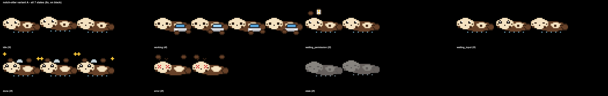

# NotchOtter

A pixel-art otter that lives on your Mac and shows the live status of every
Claude Code session you have running — an otter tucked next to the notch,
a row of otters perched on your terminal, and a floating desktop pet that
follows you when you switch away. One glance tells you which session needs
you: an approval, an answer, or just "it's done."



No API calls, no background LLM usage, no telemetry. It reads local hook
events and JSON state files with `jq`; that's the entire mechanism.

## The three surfaces

NotchOtter shows the same underlying session data through three different
views, each suited to a different moment:

| Surface | What it shows | Visible when |
| --- | --- | --- |
| **Notch panel** | One otter animating the single highest-priority state across *all* sessions, plus a compact badge like `3 working · 1 waiting` | Always, docked left of the notch |
| **Companion row** | One otter per live session, ordered and labeled to match Ghostty's real tabs | Ghostty is the frontmost app |
| **Desktop pet** | One floating otter showing the most urgent state (or, expanded, one per session) | Ghostty is *not* frontmost — while you're in the browser, editor, Slack, etc. |

All three read from the same session state files and never conflict — the
companion row and the desktop pet are mutually exclusive based on whether
Ghostty is frontmost, so you never see two floating otter rows at once.

## Feature tour

**Notch panel.** A borderless panel flush against the left edge of the
notch, showing one otter (animation = highest-priority state across every
session: `error > waiting_permission > waiting_input > working > done >
idle`) and a small badge. Click it to open a dropdown listing every
session — project name, state, age, and output-file count. Clicking a row
focuses that session's Ghostty tab; an outputs button on rows that have
them reveals the created files in Finder.

**Companion row.** While Ghostty is the frontmost app, one otter per live
session appears perched on top of the Ghostty window. Row order and labels
mirror Ghostty's actual tab order and titles, kept in sync by polling
Ghostty's own AppleScript dictionary every 2 seconds. Click an otter to
jump straight to that tab. The whole row is draggable — grab any otter and
park the row wherever you like; its position is stored as an offset from
the Ghostty window's origin, so it keeps following that window across
moves and relaunches. Right-click any otter for "Reset Position." The row
caps at 10 otters, with a "+N" overflow chip for the rest.

**Desktop pet.** Modeled on Codex-Pets: while Ghostty is *not* frontmost, a
single draggable otter floats above every other app, animating the most
urgent state across all sessions with a session-count label. Click it to
expand into one otter per session; click any expanded otter to jump to its
Ghostty tab, or click the "«" chip to collapse back down. Hovering any
otter puffs it up (1.12x) and shows a click-through bubble with the
session's status line (state · project · age) and an excerpt of its last
assistant reply. Position persists across relaunches. Right-click to hide;
there's also a menu bar toggle.

**Last-reply summaries.** On every hook event that carries a transcript
path, the hook pulls the most recent assistant text block from the
session's transcript tail, strips markdown/code fences/link syntax, and
condenses anything over 200 codepoints to "first sentence … last
sentence" (the outcome plus whatever's next) instead of a mid-word cut.
This is pure `jq` text processing over a local file — no API calls, no
tokens spent, fully offline. It's what shows up in the desktop pet's hover
bubble. Notification-type events use the notification's own message
instead, since that names the specific tool waiting on a permission
prompt. `engine/backfill_summaries.sh` fills this field in for sessions
that were already idle when the feature was installed, so their bubble
isn't blank until they next move.

**macOS notifications.** Fired on transitions *into* `waiting_permission`,
`done`, or `error` — never on `working`/`idle` — so you get a system
notification even when you're in a completely different app.

**Otter Outputs.** When a session transitions to `done` with output files
recorded, NotchOtter symlinks each still-existing file into
`~/Desktop/Otter Outputs/<YYYY-MM-DD>-<project>/`, so a session's work
product is easy to find later without hunting through the repo.

**Stale detection.** A 5-second PID liveness poll catches sessions whose
terminal was closed without a clean `SessionEnd` (killed tab, crashed
shell, etc.), marking them `stale` (rendered as a ghost otter) and pruning
their state file after a 60-second grace period.

**Custom characters ("hatch your own").** `spritegen/hatch.py` takes any
photo and turns it into a pixel-art animated sprite pack for the app:
background removal, 32px pixelation, and a matching frame set for every
session state, including on-sprite badges for waiting (`?`), done (`✓`),
error (`!`), and stale (ghost). Generated packs live under
`~/.local/share/notch-otter/sprites/<name>/`, and you pick between the
built-in otter and any installed pack from the menu bar's Character
submenu — the choice applies live across the notch panel, companion row,
and desktop pet simultaneously. A pack missing a state file just falls
back to the built-in otter's sheet for that state, so a partial pack still
works.

**Menu bar controls.** A status item showing the same compact summary text
as the notch badge, with a menu for Show/Hide Panel, Show/Hide Companion,
Show/Hide Desktop Pet, the Character submenu, Launch at Login, and Quit.

## How it works

```
Claude Code session ──(hooks, all events)──▶ otter-hook.sh ──▶ ~/.local/state/notch-otter/sessions/<id>.json
                                                                        │
                                              FSEvents watch (debounced) + 5s PID liveness poll
                                                                        ▼
                                                                 NotchOtter.app
                                                     ┌────────────────┼────────────────┐
                                                     ▼                ▼                ▼
                                              Notch panel     Companion row      Desktop pet
                                            (always visible)  (Ghostty front)  (Ghostty not front)
                                                                        ▲
                                              Ghostty AppleScript tab list (polled every 2s)
```

Hooks are pure `sh` + `jq` — no other runtime dependency — and the
dispatcher script is written to **always exit 0 and never write to
stderr**, so a malformed payload or a missing `jq` binary can never block
or slow down Claude Code itself; at worst, a state file just doesn't get
updated. The app is a small native AppKit binary (no Electron, no
webview), built with Swift Package Manager only — no Xcode project or
Interface Builder required.

## Install

Requirements: macOS 13+, `/usr/bin/jq` (ships with macOS), and Claude
Code. Ghostty ≥ 1.3 is optional — the notch panel, dropdown, and
notifications all work fine without it; only the exact-tab jump, live tab
titles, and window-perched companion row/desktop-pet positioning are
Ghostty-specific, and those degrade gracefully to cwd-based focus and
project-name labels when Ghostty isn't running or the AppleScript
dictionary is unavailable.

```bash
# 1. Register hooks (merges into ~/.claude/settings.json, backs up first)
bash engine/install.sh

# 2. Build the app bundle (requires the Swift toolchain / CommandLineTools)
bash scripts/build_app.sh

# 3. Launch
open dist/NotchOtter.app
```

On first launch, macOS will prompt for **Notifications** access (needed
for the waiting/done/error alerts) and, the first time you click a
session to jump to its Ghostty tab, an **Automation** permission prompt to
let NotchOtter control Ghostty via AppleScript — both are one-time system
prompts, not anything NotchOtter itself gates on. Use the menu bar item →
"Launch at Login" to keep it running across reboots.

## Uninstall

```bash
bash engine/uninstall.sh   # removes only NotchOtter's hook entries, restores everything else
```

`uninstall.sh` only strips entries whose command contains `notch-otter`
from `~/.claude/settings.json` — any other hooks you have registered are
left untouched — and removes the dispatcher script from
`~/.local/share/notch-otter`. Quit the app and delete `dist/NotchOtter.app`
(or wherever you moved it) to finish removing it.

## Customize your character

Turn any photo into a playable sprite pack:

```bash
python3 spritegen/hatch.py path/to/photo.jpg --name mypet
```

This generates a pack at `~/.local/share/notch-otter/sprites/mypet/` with
a sprite sheet per session state, in the same format the built-in otter
uses (see `SPEC.md` section 3: horizontal strip of square cells, one file
per state). Open the menu bar → Character to select it — every surface
(notch panel, companion row, desktop pet) switches immediately.

The procedural sprite generator that draws the built-in otter itself lives
in `spritegen/gen_sprites.py`; see `spritegen/README.md` if you want to
tweak the built-in art directly instead of hatching a photo.

## Configuration

NotchOtter has no config file — everything it remembers is a handful of
`UserDefaults` keys, set only by using the app's own UI (toggling
visibility, dragging a panel, picking a character):

- Whether the notch panel, companion row, or desktop pet is manually hidden
- The companion row's parked offset from the Ghostty window, and the
  desktop pet's absolute screen position
- The selected custom character (or none, for the built-in otter)
- Launch-at-login registration (via `SMAppService`, macOS 13+)

Live session data itself is not configuration — it's ephemeral state at
`~/.local/state/notch-otter/sessions/<session_id>.json`, one file per
active session, deleted automatically on a clean `SessionEnd` or after a
stale session's 60-second grace period. See `SPEC.md` for the full file
schema.

## FAQ

**Does this cost anything, or call any API?** No. The hook is a shell
script piping JSON through `jq`; the app watches local files and polls
local process IDs. Nothing here calls Anthropic's API, OpenAI's API, or
any other network endpoint, and no Claude Code tokens are spent — the
last-reply summary is plain text extraction from a transcript file already
sitting on disk.

**Does it work with terminals other than Ghostty?** Status monitoring —
the notch panel, badge, dropdown, and notifications — works with any
terminal, since it's driven entirely by hook events and PID checks, not by
which app is running the session. Only the exact-tab jump, live tab-title
labels, and the companion row / desktop pet's window-perch positioning
require Ghostty's AppleScript dictionary; without it, sessions just show
up unmatched (project-name labels, cwd-based focus, `firstSeenAt`
ordering) instead of disappearing.

**Privacy?** Everything stays on-device. Session state lives under
`~/.local/state/notch-otter`, sprite packs under
`~/.local/share/notch-otter`, and the only external interaction is
AppleScript talking to your own local Ghostty process.

## Project layout

```
notch-otter/
  SPEC.md              # the shared contract: state schema, transitions, sprite format
  README.md
  engine/
    otter-hook.sh          # hook dispatcher (sh + jq), branches on hook_event_name
    install.sh              # registers hooks into ~/.claude/settings.json
    uninstall.sh            # removes only notch-otter hook entries
    backfill_summaries.sh   # one-time last_summary backfill for pre-existing sessions
    test_engine.sh          # hook/engine test suite
  spritegen/
    gen_sprites.py       # procedural pixel-art generator for the built-in otter
    hatch.py              # photo -> custom sprite pack
    README.md
  assets/
    sprites/              # generated sprite sheets (built-in otter + style comps)
    previews/              # rendered preview sheets for review
  app/                    # Swift package (AppKit, macOS 13+)
    Package.swift
    Sources/NotchOtter/
  scripts/
    build_app.sh          # SPM build -> .app bundle -> ad-hoc codesign
    fake_session.sh        # writes a fake session state file, for demoing without Claude Code
```

See `SPEC.md` for the authoritative contract — session state file schema,
the exact hook-event-to-state transition table, hook registration details,
and the sprite sheet format. Any change to app behavior should land in
`SPEC.md` first, then in code.
