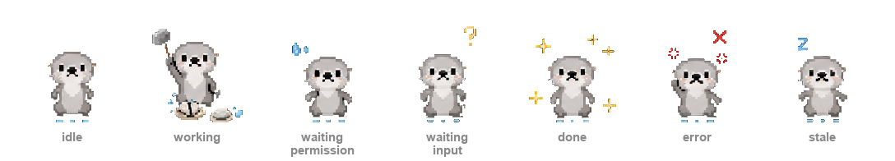

# NotchOtter

**English** | [한국어](README.ko.md)

Pixel otters that live on your Mac and show what every Claude Code session
is doing — right now, at a glance, from any app.



No API calls, no tokens, no telemetry. Everything runs on-device: Claude
Code hooks write tiny JSON state files, and a small native app renders
them as otters.

## The three surfaces

| Surface | What you see | When |
| --- | --- | --- |
| **Notch panel** | One otter next to the notch + a badge like `3 working · 1 waiting` | Always |
| **Companion row** | One otter per session, perched on your terminal, matching Ghostty's tab order | Ghostty in front |
| **Desktop pet** | One floating otter you can drag anywhere; click to expand into all sessions | Any other app in front |

The otter's animation always shows the most urgent state:
`error > waiting permission > waiting input > working > done > idle`.

## What it does

- **Jump to a session** — click any otter to focus its exact Ghostty tab.
- **Hover for context** — desktop pet otters puff up and show a bubble
  with the session's state, project, age, and a short excerpt of its last
  reply (extracted locally from the transcript — free).
- **Drag anywhere** — both the companion row and the desktop pet are
  draggable; positions are remembered.
- **Notifications** — when a session needs permission, finishes, or errors.
- **Otter Outputs** — files a session created are symlinked into
  `~/Desktop/Otter Outputs/<date>-<project>/` when it finishes.
- **Ghost otters** — sessions whose terminal died show as translucent
  ghosts, then clean themselves up.

## Install

Requires macOS 13+, Claude Code, and the Swift toolchain (Command Line
Tools). Ghostty ≥ 1.3 is optional — without it you lose only tab-jumping
and tab-order labels.

```bash
bash engine/install.sh        # register hooks (backs up your settings first)
bash scripts/build_app.sh     # build dist/NotchOtter.app
open dist/NotchOtter.app
```

macOS will ask once for Notifications, and once for Automation (to focus
Ghostty tabs). Enable "Launch at Login" from the menu bar item.

To uninstall: `bash engine/uninstall.sh` (removes only NotchOtter's hooks),
then delete the app.

## Use your own character

Turn any photo into a pixel-art character with animations and state badges:

```bash
python3 spritegen/hatch.py path/to/photo.jpg --name mypet
```

Then pick it from the menu bar → **Preferences…**. It applies instantly to
all three surfaces. Packs live in `~/.local/share/notch-otter/sprites/`;
delete a folder to remove one.

The same Preferences window also lets you choose which terminal app
NotchOtter focuses when you click a session's otter (Ghostty, iTerm2, or
Terminal.app, auto-detected). Exact-tab focus is only available for
Ghostty; iTerm2 and Terminal use best-effort window focus by working
directory.

## FAQ

**Does it cost anything?** No. There are no API calls — hooks and file
watching only. The last-reply bubble text is cut from the transcript file
already on disk.

**Terminals other than Ghostty?** Status, notch panel, notifications, and
the desktop pet all work anywhere. Tab-jumping and tab-title labels are
Ghostty-only.

**Privacy?** Nothing leaves your machine.

## More

`SPEC.md` is the authoritative contract (state schema, transitions,
sprite format). The hook engine is pure `sh` + `jq` and always exits 0 —
it can never block or slow Claude Code. The app is native AppKit built
with SPM; no Electron, no Xcode project.
